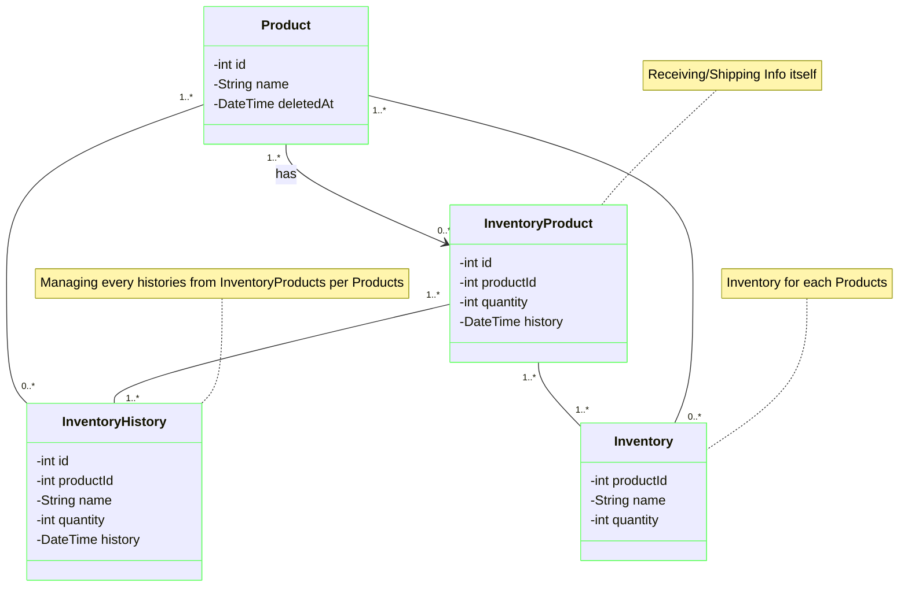
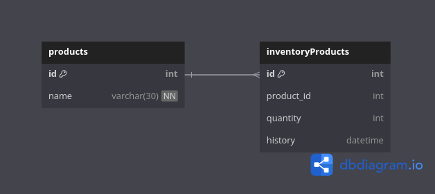

# Inventory-API

このAPIはRaiseTech第9回課題をベースに作成中です。

## 使用した主な技術・ツール

<!-- PROJECT LOGO -->
[![Java][Java]][Java-url]
[![Spring][Spring]][Spring-url]
[![SpringBoot][SpringBoot]][SpringBoot-url]
[![Docker][Docker]][Docker-url]
[![MySQL][MySQL]][MySQL-url]
[![AWS][AWS]][AWS-url]
[![IntelliJ][IntelliJ]][IntelliJ-url]

<!-- MARKDOWN LINKS & IMAGES -->

[Java]: https://img.shields.io/badge/Java-ED8B00?style=for-the-badge&logo=openjdk&logoColor=white

[Java-url]: https://getbootstrap.com

[Spring]: https://img.shields.io/badge/Spring-6DB33F?style=for-the-badge&logo=spring&logoColor=white

[Spring-url]: https://reactjs.org/

[SpringBoot]: https://img.shields.io/badge/SpringBoot-6DB33F?style=for-the-badge&logo=Spring&logoColor=white

[SpringBoot-url]: https://laravel.com

[Docker]: https://img.shields.io/badge/-Docker-EEE.svg?logo=docker&style=for-the-badge

[Docker-url]: https://angular.io/

[MySQL]: https://img.shields.io/badge/-MySQL-4479A1?style=for-the-badge&logo=mysql&labelColor=4479A1&logoColor=FFF

[MySQL-url]: https://jquery.com

[AWS]: https://img.shields.io/badge/Amazon_AWS-232F3E?style=for-the-badge&logo=amazon-web-services&logoColor=white

[AWS-url]: https://vuejs.org/

[IntelliJ]: https://img.shields.io/badge/Intellij%20Idea-000?logo=intellij-idea&style=for-the-badge

[IntelliJ-url]: https://svelte.dev/

## API概要

製品在庫を管理するAPIです。

- 商品情報（商品ID、商品名）のCRUD
- 在庫情報（在庫ID、商品ID、数量、履歴日付）のCRUD

## 作成背景

- シンプルな構成で、活用しやすいAPIとしたい
- 在庫管理という基礎的なシステムの開発を通じてCRUDを備えたRestAPI開発の学習、理解につなげたい

## API仕様書

[Inventory-API 仕様書](https://kumagai6824.github.io/Inventory-API/swagger/)

## クラス図（エンティティ部分）

## E-R図

## 環境変数

|変数名|役割|デフォルト値|
|----|----|----|
|SPRING_DATASOURCE_URL|MySQLのURL|jdbc:mysql://localhost:3308/inventory_database|
|SPRING_DATASOURCE_USERNAME|MySQLのユーザ名|user|
|SPRING_DATASOURCE_PASSWORD|MySQLのパスワード|password|

### AWS構成図

