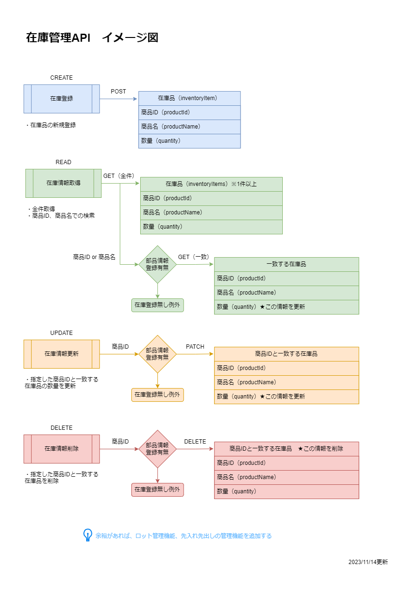
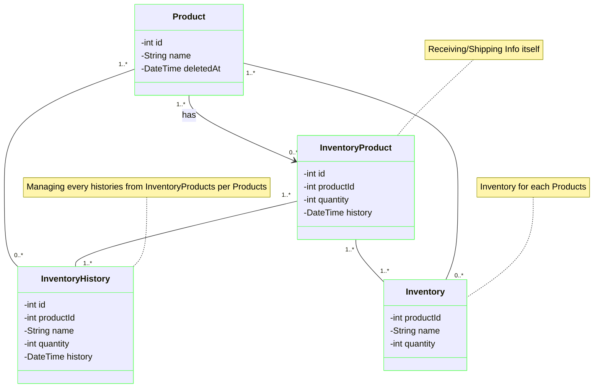

# Inventory-API

このAPIはRaiseTech第9回課題をベースに作成中です。

## API概要

製品在庫を管理するAPIです。

- 商品ID、商品名、在庫数量の管理（must）
- 製造ロット番号（トレーサビリティ）の管理（want）
- 在庫品の先入れ先出しの管理（want）

## 作成背景

- 現職システムは複雑で多くの情報を管理しているものの実務で活用できていない
- シンプルな構成で、活用しやすいAPIとしたい
- 製造ロットの管理は手書きしている場合、書き間違えや工数大等の課題あり
- 先入れ先出しはロット番号の管理と組み合わせ在庫管理システムに入れることでヒューマンエラー対策の一つになる

## アプリのイメージ図

## API仕様書

swagger[Inventory-API](https://kumagai6824.github.io/Inventory-API/swagger/)

## クラス図（エンティティ部分）

## E-R図

## 環境変数

|変数名|役割|デフォルト値|
|----|----|----|
|SPRING_DATASOURCE_URL|MySQLのURL|jdbc:mysql://localhost:3308/inventory_database|
|SPRING_DATASOURCE_USERNAME|MySQLのユーザ名|user|
|SPRING_DATASOURCE_PASSWORD|MySQLのパスワード|password|

