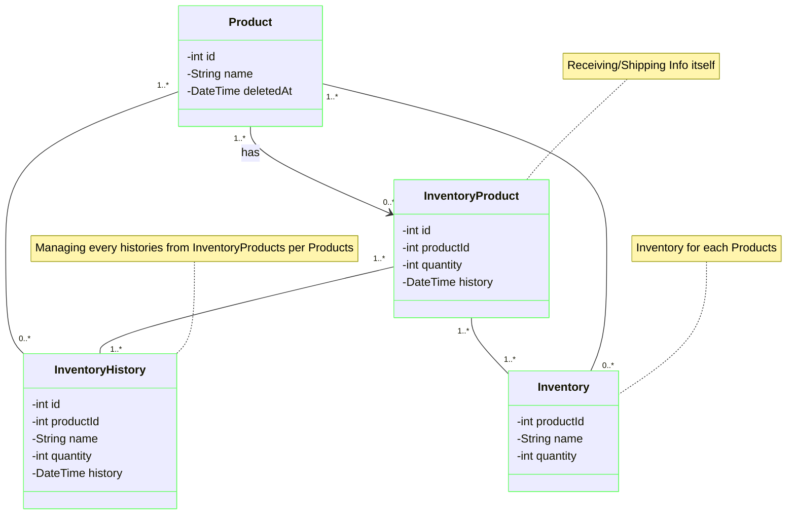

# Inventory-API

このAPIはRaiseTech第9回課題をベースに作成中です。

## 使用した主な技術・ツール

<!-- PROJECT LOGO -->
[![Java][Java]][Java-url]
[![Spring][Spring]][Spring-url]
[![SpringBoot][SpringBoot]][SpringBoot-url]
[![Docker][Docker]][Docker-url]
[![MySQL][MySQL]][MySQL-url]
[![AWS][AWS]][AWS-url]
[![IntelliJ][IntelliJ]][IntelliJ-url]

<!-- MARKDOWN LINKS & IMAGES -->

[Java]: https://img.shields.io/badge/Java-ED8B00?style=for-the-badge&logo=openjdk&logoColor=white

[Java-url]: https://getbootstrap.com

[Spring]: https://img.shields.io/badge/Spring-6DB33F?style=for-the-badge&logo=spring&logoColor=white

[Spring-url]: https://reactjs.org/

[SpringBoot]: https://img.shields.io/badge/SpringBoot-6DB33F?style=for-the-badge&logo=Spring&logoColor=white

[SpringBoot-url]: https://laravel.com

[Docker]: https://img.shields.io/badge/-Docker-EEE.svg?logo=docker&style=for-the-badge

[Docker-url]: https://angular.io/

[MySQL]: https://img.shields.io/badge/-MySQL-4479A1?style=for-the-badge&logo=mysql&labelColor=4479A1&logoColor=FFF

[MySQL-url]: https://jquery.com

[AWS]: https://img.shields.io/badge/Amazon_AWS-232F3E?style=for-the-badge&logo=amazon-web-services&logoColor=white

[AWS-url]: https://vuejs.org/

[IntelliJ]: https://img.shields.io/badge/Intellij%20Idea-000?logo=intellij-idea&style=for-the-badge

[IntelliJ-url]: https://svelte.dev/

## API概要

製品在庫を管理するAPIです。

- 商品ID、商品名、在庫数量の管理（must）
- 製造ロット番号（トレーサビリティ）の管理（want）
- 在庫品の先入れ先出しの管理（want）

## 作成背景

- 現職システムは複雑で多くの情報を管理しているものの実務で活用できていない
- シンプルな構成で、活用しやすいAPIとしたい
- 製造ロットの管理は手書きしている場合、書き間違えや工数大等の課題あり
- 先入れ先出しはロット番号の管理と組み合わせ在庫管理システムに入れることでヒューマンエラー対策の一つになる

## API仕様書

[Inventory-API 仕様書](https://kumagai6824.github.io/Inventory-API/swagger/)

## クラス図（エンティティ部分）



## E-R図


## 環境変数

|変数名|役割|デフォルト値|
|----|----|----|
|SPRING_DATASOURCE_URL|MySQLのURL|jdbc:mysql://localhost:3308/inventory_database|
|SPRING_DATASOURCE_USERNAME|MySQLのユーザ名|user|
|SPRING_DATASOURCE_PASSWORD|MySQLのパスワード|password|

<!-- APIの使い方 -->

## APIの使い方

curlコマンドなどでHTTPリクエストをします。

各URL、リクエスト内容は[API仕様書](https://kumagai6824.github.io/Inventory-API/swagger/)に記載しています。

### サーバーへのリクエストの場合

AWSサーバーはコストの関係上、必要時のみ立てており、通常は止めています。ご了承ください。

サーバー稼働時は次のようなリクエストを行います。

#### 例）商品情報の取得

```
$ curl http://shinichirokumagai.com/products
  % Total    % Received % Xferd  Average Speed   Time    Time     Time  Current
                                 Dload  Upload   Total   Spent    Left  Speed
100    85    0    85    0     0    556      0 --:--:-- --:--:-- --:--:--   559[{"id":1,"name":"Bolt 1","deletedAt":null},{"id":2,"name":"Washer","deletedAt":null}]

```

### ローカル環境の場合

次のようにローカル環境で実行します（Dockerを使います）。

1. GitHubリポジトリをローカル環境にCloneします

```
git clone https://github.com/Kumagai6824/Inventory-API.git
```

2. APIのディレクトリでDocker を立ち上げます

```
docker compose up
```

3. APIを立ち上げます

```
./gradlew bootRun
```

4. curlなどで次のようにリクエストしレスポンスが来ます

#### 例）商品情報の取得

```
$ curl http://localhost:8080/products
  % Total    % Received % Xferd  Average Speed   Time    Time     Time  Current
                                 Dload  Upload   Total   Spent    Left  Speed
100    85    0    85    0     0    556      0 --:--:-- --:--:-- --:--:--   559[{"id":1,"name":"Bolt 1","deletedAt":null},{"id":2,"name":"Washer","deletedAt":null}]

```
