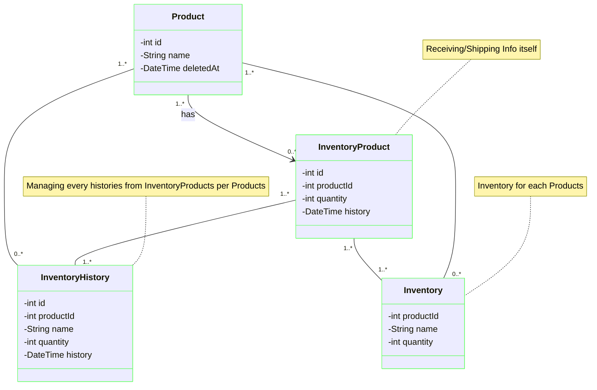

# Inventory-API

このAPIはRaiseTech第9回課題をベースに作成中です。

## 使用した主な技術・ツール

<!-- PROJECT LOGO -->

[![Java][Java]][Java-url]
[![Spring][Spring]][Spring-url]
[![SpringBoot][SpringBoot]][SpringBoot-url]
[![HTML5][HTML5]][HTML5-url]
[![JavaScript][JavaScript]][JavaScript-url]
[![Docker][Docker]][Docker-url]
[![MySQL][MySQL]][MySQL-url]
[![AWS][AWS]][AWS-url]
[![IntelliJ][IntelliJ]][IntelliJ-url]

<!-- MARKDOWN LINKS & IMAGES -->

[Java]: https://img.shields.io/badge/Java-ED8B00?style=for-the-badge&logo=openjdk&logoColor=white
[Java-url]: https://getbootstrap.com
[Spring]: https://img.shields.io/badge/Spring-6DB33F?style=for-the-badge&logo=spring&logoColor=white
[Spring-url]: https://reactjs.org/
[SpringBoot]: https://img.shields.io/badge/SpringBoot-6DB33F?style=for-the-badge&logo=Spring&logoColor=white
[SpringBoot-url]: https://laravel.com
[HTML5]: https://img.shields.io/badge/HTML5-E34F26?style=for-the-badge&logo=html5&logoColor=white
[HTML5-url]: https://developer.mozilla.org/ja/docs/Web/HTML
[JavaScript]: https://img.shields.io/badge/JavaScript-F7DF1E?style=for-the-badge&logo=javascript&logoColor=black
[JavaScript-url]: https://developer.mozilla.org/ja/docs/Web/JavaScript
[Docker]: https://img.shields.io/badge/-Docker-EEE.svg?logo=docker&style=for-the-badge
[Docker-url]: https://angular.io/
[MySQL]: https://img.shields.io/badge/-MySQL-4479A1?style=for-the-badge&logo=mysql&labelColor=4479A1&logoColor=FFF
[MySQL-url]: https://jquery.com
[AWS]: https://img.shields.io/badge/Amazon_AWS-232F3E?style=for-the-badge&logo=amazon-web-services&logoColor=white
[AWS-url]: https://vuejs.org/
[IntelliJ]: https://img.shields.io/badge/Intellij%20Idea-000?logo=intellij-idea&style=for-the-badge
[IntelliJ-url]: https://svelte.dev/

## API概要

製品在庫を管理するAPIおよび動作確認用簡易Web UIです。

- 商品情報（商品ID、商品名）のCRUD
- 在庫情報（在庫ID、商品ID、数量、履歴日付）のCRUD
- ブラウザ上から直感的に操作可能な動作確認用フロントエンド（ダッシュボード）

## 作成背景

- シンプルな構成で、活用しやすいAPIとしたい
- 在庫管理という基礎的なシステムの開発を通じてCRUDを備えたRestAPI開発の学習、理解につなげたい
- API単体にとどまらず、ブラウザ上での入出力動作（Fetch API連携）を視覚的に体験・テストできるようにしたい

## 簡易ダッシュボード（フロントエンド）

APIの各種エンドポイントをブラウザから直感的にテスト・操作するためのHTML/JavaScriptによる簡易管理画面を提供しています。

### 起動・アクセス方法

1. アプリケーションを起動します（`./gradlew bootRun` 等）
2. ブラウザで以下のURLにアクセスします：
   - **`http://localhost:8080/index.html`** （または `http://localhost:8080/`）

### 提供機能

- **商品管理**：一覧表示、新規登録、名称変更、削除
- **在庫・入出庫管理**：現在在庫一覧の更新、入庫/出庫登録、履歴数量の修正

_(ここに画面キャプチャやGIFアニメーションを配置)_

<!--  -->

## API仕様書

[Inventory-API 仕様書](https://kumagai6824.github.io/Inventory-API/swagger/)

## クラス図（エンティティ部分）

```mermaid
classDiagram
        class Product {
            -int id
            -String name
            -DateTime deletedAt
        }

        note for InventoryProduct "Receiving/Shipping Info itself"
        class InventoryProduct {
            -int id
            -int productId
            -int quantity
            -DateTime history
        }

        note for InventoryHistory "Managing every histories from InventoryProducts per Products"
        class InventoryHistory {
            -int id
            -int productId
            -String name
            -int quantity
            -DateTime history
        }

        note for Inventory "Inventory for each Products"
        class Inventory {
            -int productId
            -String name
            -int quantity
        }

    Product "1..*" --> "0..*" InventoryProduct : has
    InventoryProduct "1..*" -- "1..*" InventoryHistory
    Product "1..*" -- "0..*" InventoryHistory
    Product "1..*" -- "0..*" Inventory
    InventoryProduct "1..*" -- "1..*" Inventory

    style Product stroke:#6f6
    style InventoryProduct stroke:#6f6
    style InventoryHistory stroke:#6f6
    style Inventory stroke:#6f6
```
